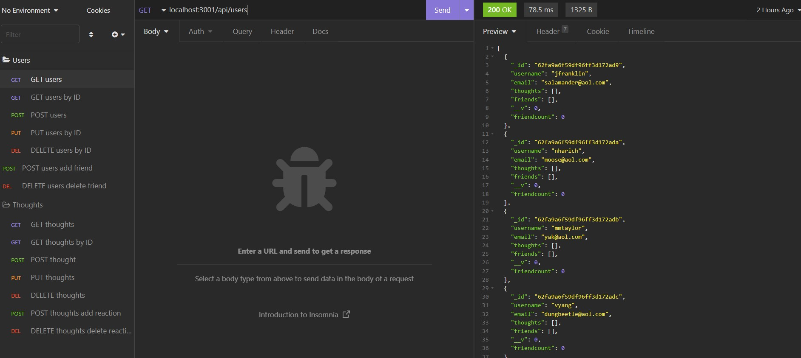
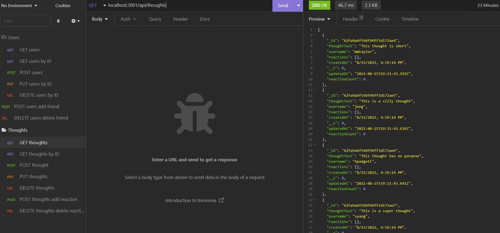
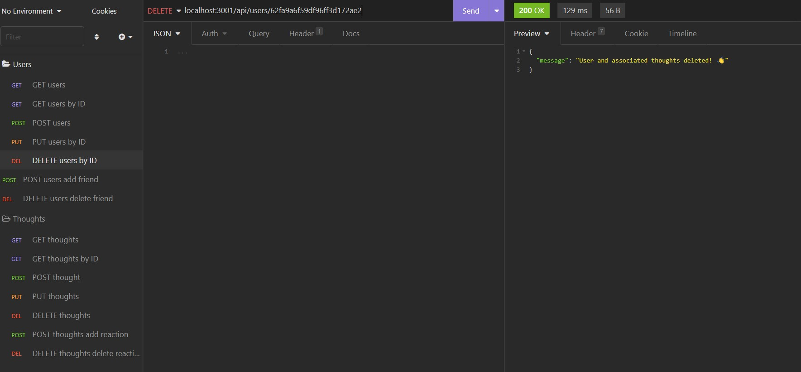

# Social-Network-API

      


  ## Description
  
  Social Network API is an API social network web application where users can share their thoughts, react to friends' thoughts, and create a friend list. This application uses Express.js for routing, a MongoDB database, and the Mongoose ODM. The database, models, and routes have been created to make this application back-end functional.

  A few examples of testing routes in insomnia.
  
  
  

  [Link to Walkthough Video](https://drive.google.com/file/d/1-RSisbQtVtqO8lXukffN7hBzR-ZbXb8T/view)

  ## Table of Content
  - [Installation](#installation)
  - [Usage](#usage)
  - [Contributing](#contributing)
  - [Tests](#tests)
  - [Questions](#questions)
  - [License](#license)

  ## Installation

  To install, run ```npm i``` in the command line. To seed the database, run ``` npm run seed ``` in the command line. 

  ## Usage

  Once dependencis and databse have been installed, run ```npm start``` in the terminal to start the sever.

  ## Contributing

  This application is not currently accepting applications.

  ## Tests
  
  You can test the CRUD routes through insonmia while the server is running.

  ## Questions

  If you have any questions, contact me at j.franks725@gmail.com. Visit my GitHub page at [jfranklin12](https://github.com/jfranklin12/) to see my other projects.

  ## Liscence
    
  This projected is licensed under MIT.

  https://opensource.org/licenses/MIT

